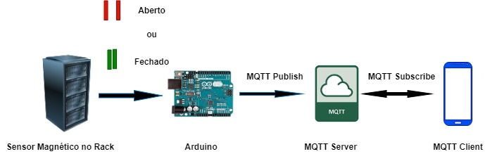

# projeto-mqtt-alexsander
Repositório criado para armazenar Projeto com Arduino e Rack
## Objetivos

Repositório utilizado para demonstrar codigo criado para funcionamento do Arduino Uno e Rack com Sensor 

Magnético monitorando se a porta do Rack está ABERTO ! ou Fechado ! e enviando mensagem utilizando protocolo MQTT

ao Server MQTT (AWS) e exibindo no Client MQTT (<a href="https://play.google.com/store/apps/details?id=net.routix.mqttdash&hl=en&gl=US" target="_blank">MQQT Dash</a>) instalado em um Smartphone conforme figura abaixo:

### Foram utilizadas as seguintes bibliotecas:

<a href="https://github.com/UIPEthernet/UIPEthernet" target="_blank">UIPEthernet</a>

<a href="https://github.com/knolleary/pubsubclient" target="_blank">pubsubclient</a>

## Materiais:

Arduino Uno

Modulo Ethernet (ENC28J60)

Sensor Magnético (MC-38)

Jumpers

## Circuito:

Autor: Alex Sander

